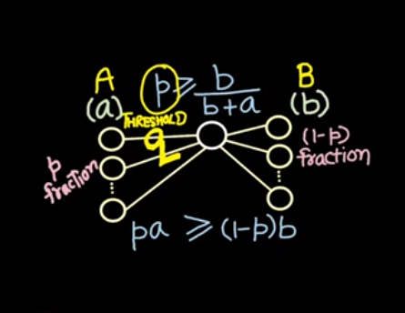
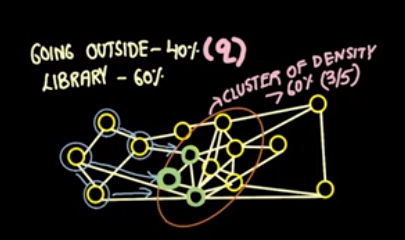
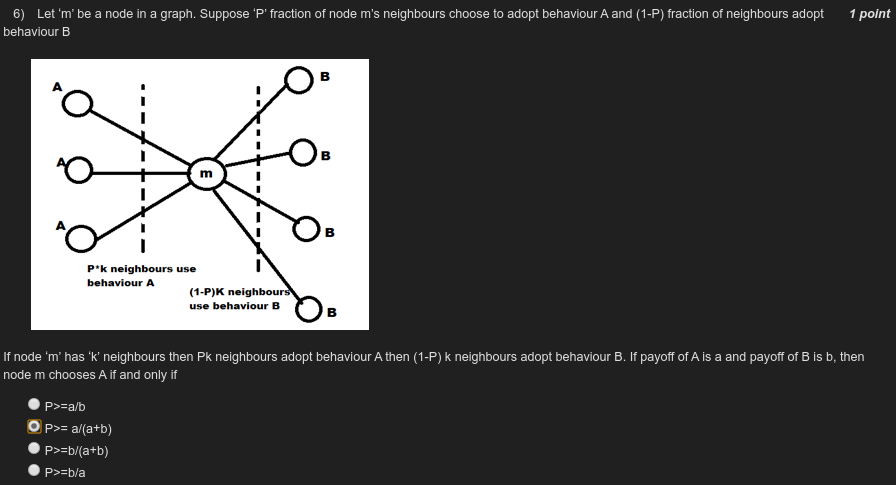

week-7

- how does ideas spread thru a network
	- it is decided by the payoff attached to an activity, with the no. of neighbours who are doing that activity
	- 
- cascade
	- if ideas spread b/w two different communities
- cluster density
	- what fraction of neighbours of a node in a cluster, are in the same cluster 
- non diffusion
	- if q is threshold, then if there is a cluster with density > 1 - q, then the idea will not cascade thru the entire graph
	- 
- 
- 
[random_graph.gml](./_resources/e7fd184da626441d9c9c112c4baf014b.gml)

[random_graph_two_communities.gml](./_resources/5dad9632bf8c4354b3f913ea0ec7985a.gml)

[create_center_community.py](./_resources/06774ca951f646e99f3e42824f3dace6.py)

[diffusion.py](./_resources/11a51086ccae46aa8e67fae221b93716.py)

[idea-1.py](./_resources/608107305ae44a2b9f89c83b605879c9.py)

[idea-2.py](./_resources/5c98f27ae56943ebaef689cb00db3167.py)

[idea-3.py](./_resources/114e043692b14cc28f4a9f47f3a0002b.py)

