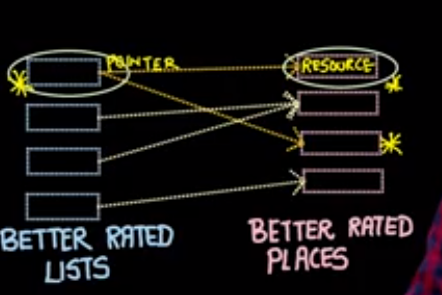
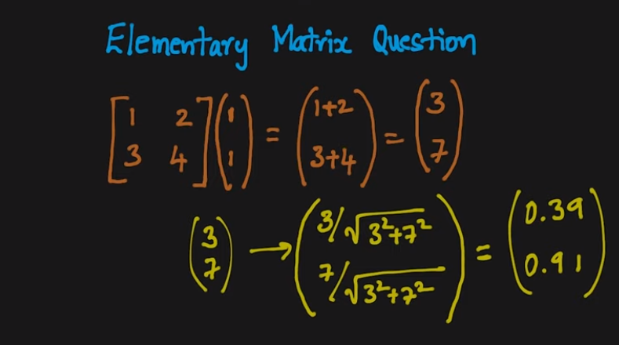
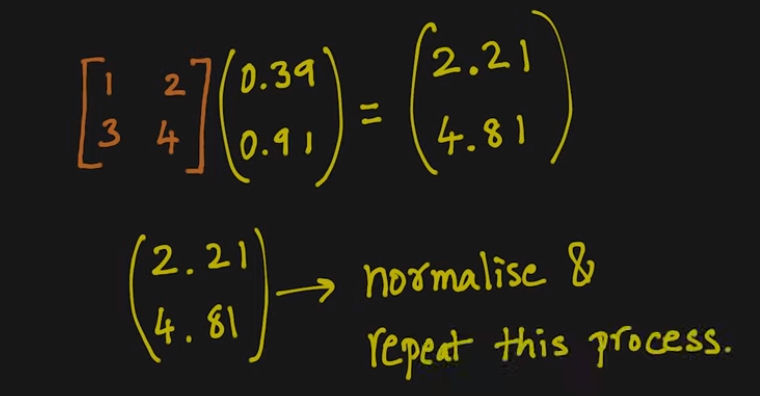
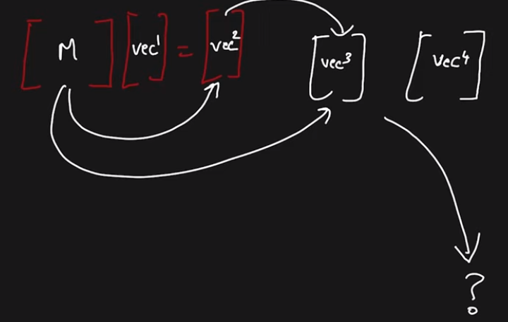
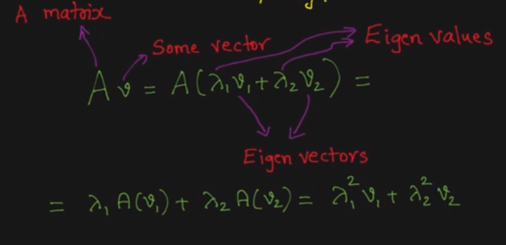
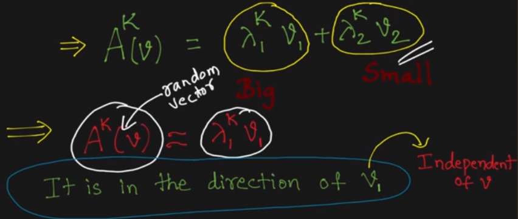
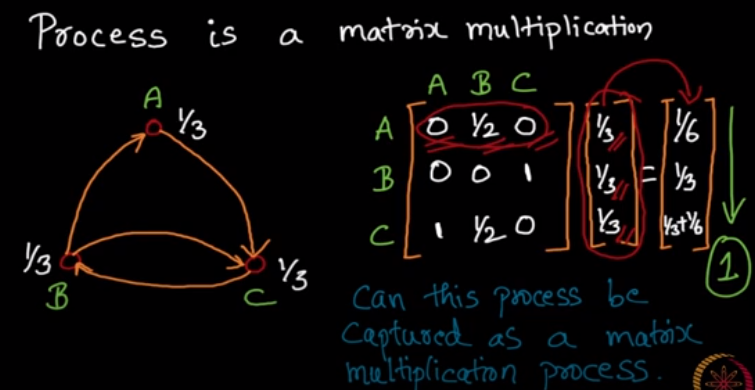

week-8

- principle of repeated improvement
	- if husband happy, he supports spouse more
	- if spouse supported, becomes more happy
	- if spouse happy, she supports husband more
	- if husband supported, he becomes more happy
	- and on and on
- 
- repeated matrix multiplication
	- 
	- 
	- 
	- this converges
- how repeated matrix multiplication converges
	- 
	- 
- 
