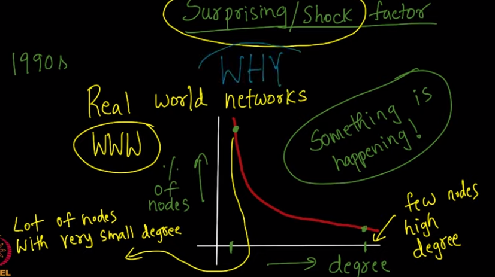
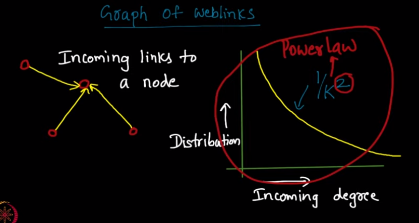

week-9

- in nature, mainly in humans
	- a normal curve is observed for the distribution of various features like heights of people vs percent of people, similarly weight, iq etc
	- the degree distribution vs percent of nodes was also supposed to be like this bell curve or normal curve
	- but then scientists found out that it is not bell curve, rather it is a drop.
	- 
- central random variable
	- resultant which is sum of several random variable gives a normal distribution
	
- power law
	- there is an exponential drop when we see the distribution of in degrees of websites, the function if 1/k2
	- similar is the graph of length of call and its distribution
	- 
	- to confirm that the power law applies or not, take a plot of log on the equation, now if we get y = -mx, then yes else no
	- power law takes place as and when the higher degree have higher probability of attracting even higher digree, and lower have less so.., 
		- there are lots with low digree, and only few with high degree

- barabasi albert model
	- simulating the behaviour of above power law graph in programing using the principle of higher degrees have higher influence to connect with them