week-10

- rich become richer
	- so how come rich people come to be in the first place?
- download distribution of songs in different forems 
	- are different
	- due to rich get richer phenomenon
- questions raised
	- how can we subtract popularity obtained by rich get rich phenomynon, and detect right talent
	- how does one judge true value of entity
-more selling books to less selling books
	-  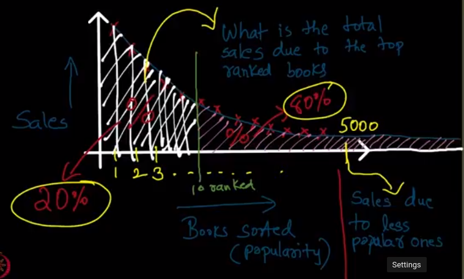
	- 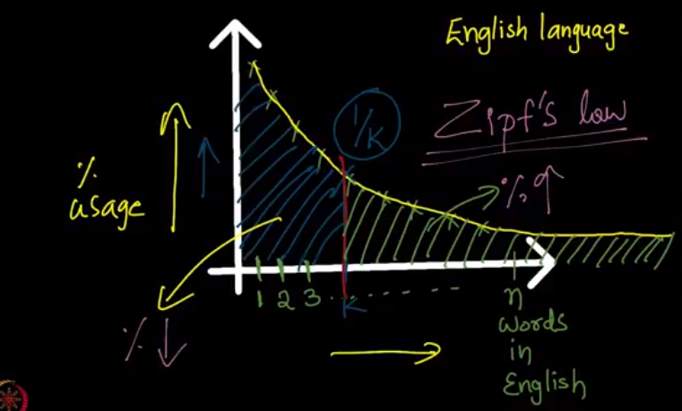
	- this is known as long tail phenomenon
	
**Epidemic**
- is similar to diffusion of ideas in a network, except
	- here we don't have choice to not accepting
	- here we can't know who exactly gave us this disease

- spreadness of epidemic
	- degree of contagiousness
	- density of network
- simple branching process for modeling epidemic
	- if every node has k children
	- and probability of passing is p
	- then no. of spreads per node is pk
	- 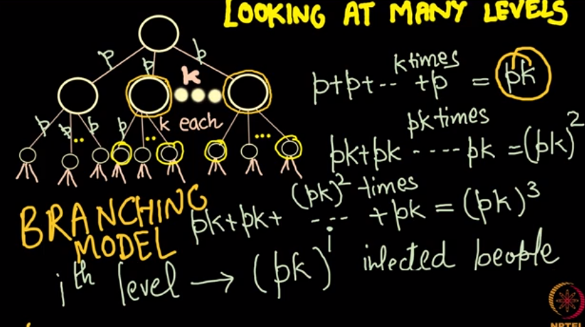
	- this pk is called R0, basic reproductive number
	- meaning that if it is less than 1 then the epidemic will eventually die away
	- if R0 >= 0, then disease becomes epidemic

- knife edge property
	- the R0 is a very important number because if it is even a little more than 1 like 1.01, the disease will keep on growing, but even if it is like very less on left of 1, like 0.999, then we know for sure that the disease will eventually die away.
	- we can reduce this number by reducing pk, now we can reduce p with the help of measures like masks, social distance etc. while we can reduce k with the help of quaranteen

- relating studied model to covid scenario
	- https://www.youtube.com/watch?v=F9rBqddjypI

- graph models

	- sir model
		- susceptible (can get affected)
		- infected (can spread)
			- has a time Ti of being affecting
		- recovered/removed (can no longer spread)

	- sis model 
		- suseptible, infected, susceptible

- difference b/w sir & sis
	- sir
		- has two end configurations
			- either all nodes are recovered
			- or contagion dies out
	- sis
		- here only stops if contagion dies
		- can keep running forever
- percolation model
	- 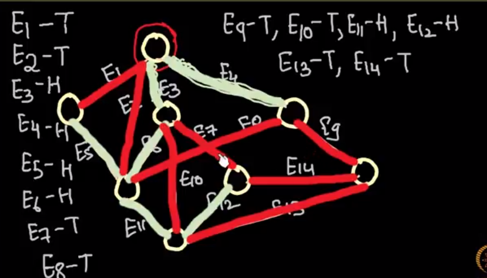
	- we flip coins for all the edges in the beginning itself
	- then wherever we got heads we open the pipes else we close them
	- now, we can predict if a node is affecteed by trasversing the open pipes from root

- analyzing basic reproductive number
	- 
	- 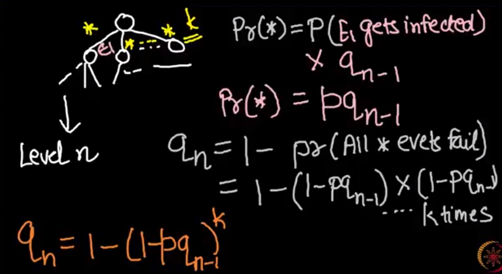
	- 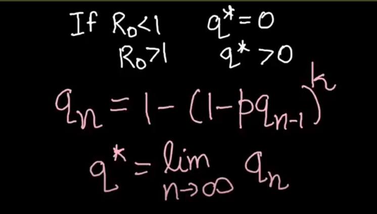
	- above we have to prove first two statements
	- 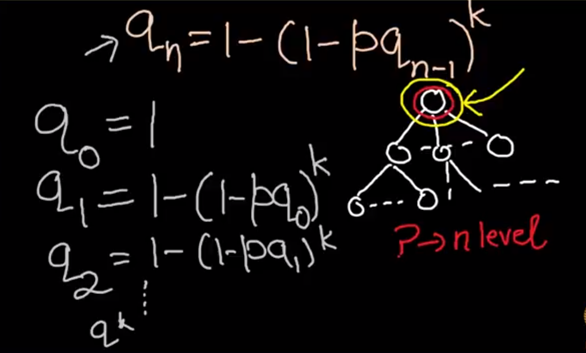
	- 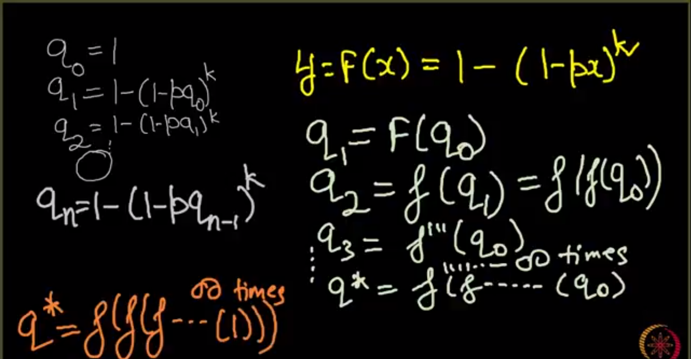
	- 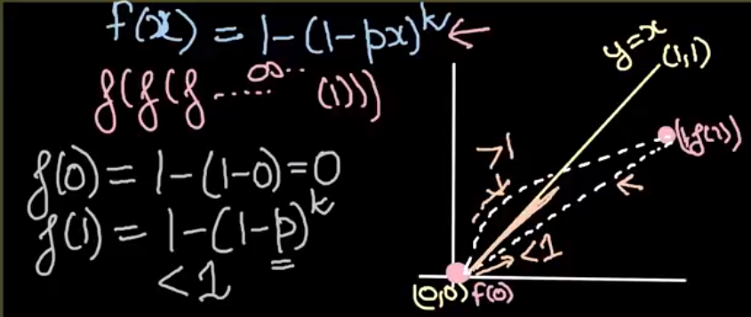
	- finding slope of the above function
	- 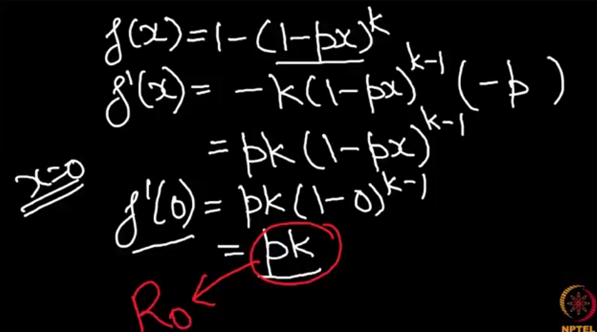
	- 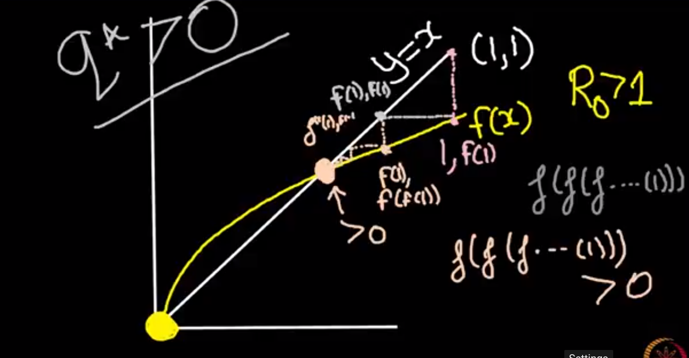
	- 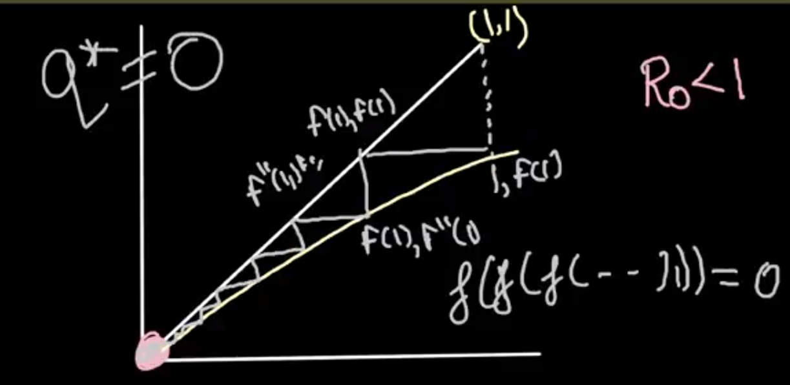