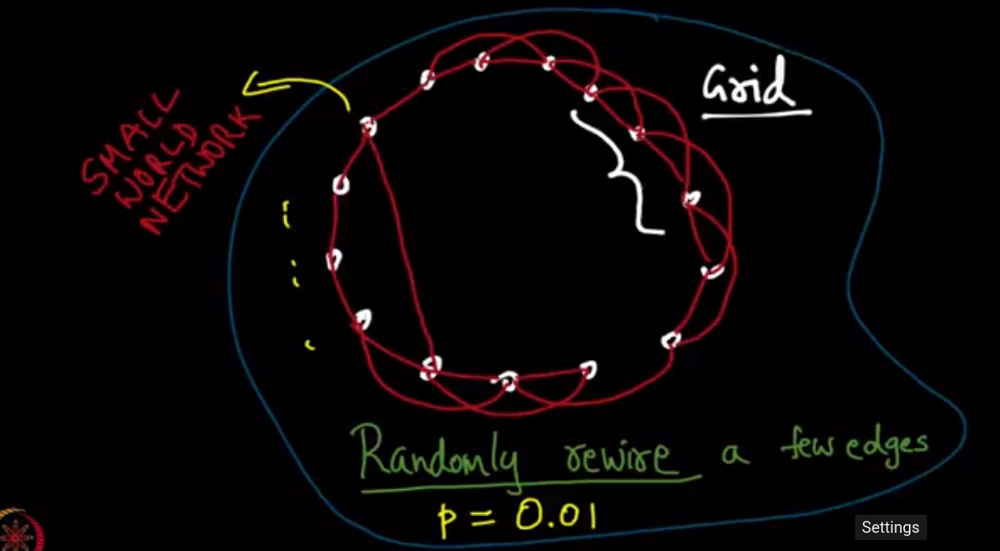

week-11

- small world phenomenon
	- any two people in the world are connected by on an everage 6 hops
	- milgram proved this by passing letters b/w two strangers in diff. part of world
	- anyway if we check the number of friends of our friends and their friends .. 6 times it is more than 1012. So, i just might know anybody after six hops
	- reason
		- homophili (close people mostly know each other)
		- weak ties (some people know far away people)

- generative model	
	- vats and strogats gave hypothesis that homophili and weak ties cause small world phenomenon
	- 
	- this graph is made by taking probability of edge inversly proportionaly to distance to power k
	- if k is 2 then we get shortest path
- the letter passing experiment is like a search algorithm, more like decentralized search
- 

