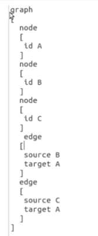
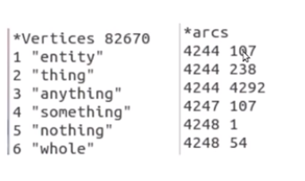
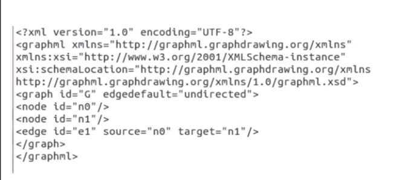
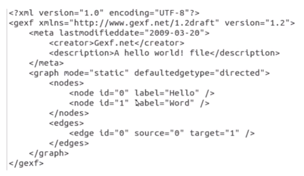

week 2

- ingredient network
	- communities are found in networks, with strong connection among themselves
- synonymy network
	- if we connect all the words in a dictionary which are synonyms to each other then we will find that the graph is connected, love is synonym to a word .. which is synonym to another word .. which is synonym to hate

- network data sets formats
	- csv
		- comma seperated values
			- edge & weight
			- adjacency
			- no label and shit
	- gml
		- graph modeling language
		- 
		- can add label
	- pajek net format
		- .net or .paj
		- 

	- graphML
		- 

	- gefx format
		- 


- properties
	- degree distribution
		- the frequency of degrees
	- degree density
		- the no. of edges/ total possible edges
	- clustering coefficient
		- the direct connections between neighbours of a node / total possible connections b/w them


```
import networkx as nx
import matplotlib.pyplot as plt

#G=nx.read_edgelist('datasets/facebook_combined.txt')
#G=nx.read_pajek('datasets/football.net')
#G = nx.read_graphml('dataset/manhatten.graphml')
#G = nx.read_gexf('datasets/diseasome.gexf')
G = nx.read_gml('datasets/karate.gml', label = 'id')
#print(nx.info(G))

#print(nx.number_of_nodes(G))
#print(nx.number_of_edges(G))
#print(nx.is_directed(G))

#nx.draw(G)
'''
def plot_deg_dist(G):
    all_degrees = list(dict(nx.degree(G)).values())
    unique_digrees = list(set(all_degrees))

    count_of_degrees = list()
    for i in unique_digrees:
        x = all_degrees.count(i)
        count_of_degrees.append(x)

    plt.loglog(unique_digrees, count_of_degrees, 'go-')
    plt.xlabel('Degrees')
    plt.ylabel('Number of nodes')
    plt.title('Degree distribution of karate network')
    plt.show()
'''
#nx.draw_circular(G)
#plt.show()

#plot_deg_dist(G)

#print("Density is ",nx.density(G))

#nx.clustering(G)

'''
for i in nx.clustering(G).items():
    print(i)
'''
#print(nx.average_clustering(G))

print("diameter is ",nx.diameter(G))
```


- if gephy show initialization
```
export MESA_LOADER_DRIVER_OVERRIDE=i965
```


- in a graph, the probability of a vertex being isolated after n*log(n) edges being put on it is (1/n)<sup>2</sup>


