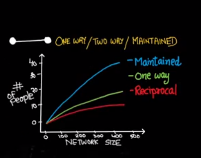

week-3

**granovetter's weak ties**
- strength of weak ties
	- 90% people get to know wbaout their current job from their aquintancess rather than their friends
- clustering coefficient
	- from week 2
- neighbourhood overlap
	- ration of common friends to total friends of a& b, friends(a)and friends(b)/ friends(a) or friends(b)

**bridges**
- edge connecting two nodes which have no other connection
- local bridges : edge with no triads between nodes..
- local bridges form weak ties
- strong-triadic-clossure
	- if a node is connected to two other nodes, than it is highly probable that those two nodes also become connected, making it a triad
- 

**embeddedness**
- more neighbourhood overlap, more is embeddedness
- more common friends means more trust, less mistrust
- 

**Passive engagement in scial media**
- 
	- maintained means, just watching others pics and commenting and uploading ones pics
	- reciprocal = two way communication
		- strong ties is constant for every person on social media, around 50-60

**Find communities in a graph**
- by finding the highways in the graph that connects cities
- this is done by finding edge with high betweenness
- 

- algorithms for seperating communities
	- 

[brute_communities.py](./_resources/579922b1f5f041ac8554bbe171e9bfaf.py)

[girvan_newman.py](./_resources/8432bc4c86024bb79df0bc13f4762967.py)